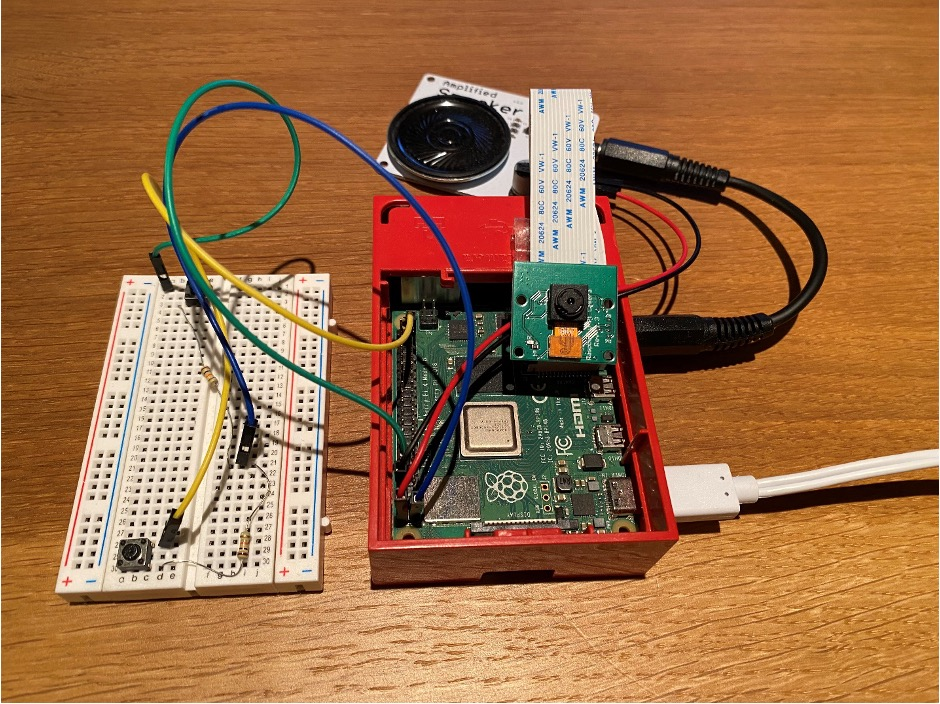
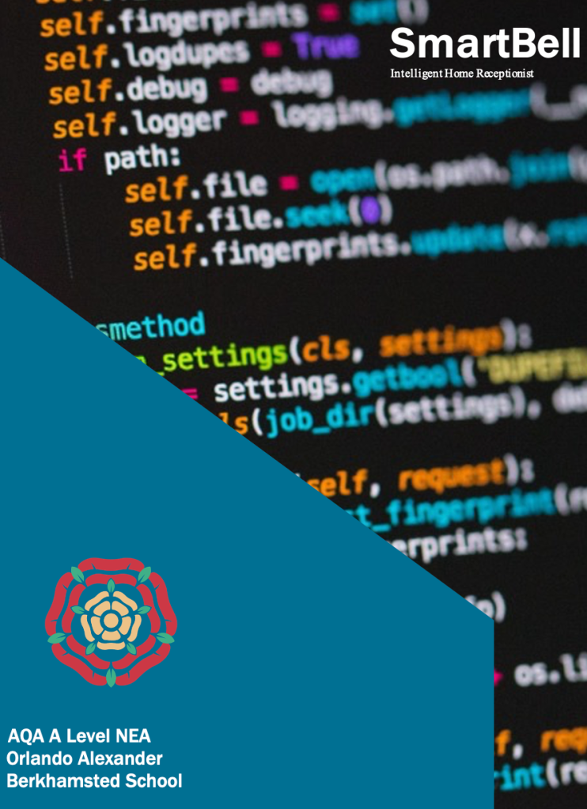

# **SmartBell – Intelligent Video Doorbell**

**This project was **completed** as part of A Level Computer Science and was awarded 97%.**

For the coursework component of my Computer Science A Level, I wanted to create a project which was genuinely useful. One day I was talking with a family friend who, during COVID, worked mainly from home. She mentioned that often her work calls would get interrupted by people ringing the doorbell, making it hard to stay focused and professional. So, I made it my mission to solve her problem!

Over the course of many months, I designed, developed, tested and refined my solution - and here, in this post, is the final product of much hard-work!

## **So, what exactly is my solution?**

Simply put, it's a doorbell with a brain. The doorbell itself is essentially a Raspberry Pi with some wires dangling off it: a camera, speaker and a button. When the doorbell is rung, the nifty camera captures a photo of the visitor and, if they're a regular, works out their name with a little bit of computer vision (_OpenCV_). Now, the second aspect of the project: the mobile app. This app allows the user to interact with the doorbell (and whoever is ringing the doorbell during a conference call!) directly from their phone. So when the doorbell is rung, a notification pops up on their phone, along with a picture of the visitor (and their name where possible). And then, without leaving their desk, the busy home-worker can then quickly select a pre-recorded audio message to be played through the doorbell's speaker - perhaps 'Could you leave the shopping by the porch?'. In the case that they're out and about when the doorbell is rung, the app will also store a log of all the visits to their house.

Check out this video below to see the doorbell in action:

https://www.youtube.com/watch?v=hvcWZEq3k6o

If you'd like to read the code I wrote for this project, here's the GitHub repositories for the [Raspberry Pi](https://github.com/orlandoalexander/ComputerScience-A-Level-NEA-RPi), [Mobile App](https://github.com/orlandoalexander/ComputerScience-NEA-App) and [Web Server](https://github.com/orlandoalexander/Computer-Science-A-Level-NEA-Web-Server).

## The Report

This report is COMPREHENSIVE to say the least! It covers the ins and outs my solution, as well as challenges faced along the way; there's also lots of pretty diagrams, so enjoy!

[SmartBell Report](https://orlandoalexander.wordpress.com/wp-content/uploads/2022/10/smartbell-report.docx)[Download](https://orlandoalexander.wordpress.com/wp-content/uploads/2022/10/smartbell-report.docx)
